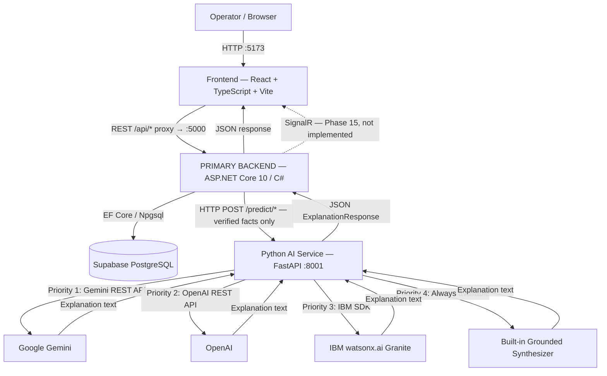

# SupplyShield AI — Architecture

## Overview

SupplyShield AI is a supply-chain operations intelligence platform. It monitors shipments, detects disruptions, monitors cold-chain sensor data, identifies idle fleet assets, and provides AI-powered recommendations — all from a centralized operations command center.

---

## System Architecture



---

## Layer Architecture (ASP.NET Core Backend)

```
SupplyShield.Api              ← HTTP controllers, Program.cs, middleware, DI bootstrap
      ↓ references
SupplyShield.Application      ← Service interfaces (IAiService, IShipmentService…),
                                DTOs, validation — no EF Core, no HTTP
      ↓ references
SupplyShield.Domain           ← Entities, enums, domain rules — ZERO external dependencies
      ↑ also referenced by
SupplyShield.Infrastructure   ← EF Core AppDbContext, Supabase wrapper,
                                AI service HTTP client (AiServiceClient),
                                AiServiceImpl (IAiService implementation),
                                Migrations
```

**Dependency rule (enforced):**
- Domain has no dependencies.
- Application depends only on Domain.
- Infrastructure depends on Domain and Application.
- Api depends on Application and Infrastructure (for DI registration only).
- Business logic never lives in controllers — controllers only call service interfaces.

---

## AI Data Flow

```
Operator triggers AI explanation in UI
          ↓
POST /api/ai/explain/shipment/{id}  (AiController)
          ↓
AiServiceImpl.ExplainShipmentAsync()
          ↓  EF Core — loads Shipment + active ShipmentDisruptions from PostgreSQL
Assembles verified fact dict (no raw user input, no invented data)
          ↓
AiServiceClient.GenerateExplanationAsync()
          ↓  HTTP POST /predict/explain  →  Python AI Service (port 8001)
build_shipment_prompt(facts)  →  prompt assembled from verified facts only
          ↓
MultiProviderLLMClient.generate(prompt)
          ↓  routes to: Gemini → OpenAI → watsonx.ai → Grounded Synthesizer
Active LLM provider returns explanation text
          ↓
FastAPI returns ExplanationResponse JSON
          ↓
AiServiceClient returns explanation string to AiServiceImpl
          ↓
AiController returns HTTP 200  {status, shipmentId, explanation}
          ↓
Frontend displays explanation to operator
```

**Critical AI rules (enforced throughout the code):**
- AI receives **only** verified structured facts from the backend — never raw user input.
- AI **must not** invent shipment IDs, costs, ETAs, temperatures, or disruption facts.
- AI failure returns a safe fallback string — never an HTTP error or crash.
- Consequential actions require: Recommendation → Human Review → Explicit Approval → Backend Action → Audit.

---

## AI Approval Flow

```
Deterministic risk score + recommendation (ASP.NET Core backend)
          ↓
Operator reviews in command center UI
          ↓
Explicit confirmation dialog (UI — not yet implemented, Phase 9)
          ↓
POST /api/recommendations/{id}/approve  (not yet implemented, Phase 9)
          ↓
ASP.NET Core backend applies action (reroute / fleet redeploy / hold)
          ↓
DecisionAudit record created  (immutable, OperatorId + BeforeState + AfterState)
          ↓
Monitoring continues
```

> ⚠️ Currently only `POST /api/alerts/{id}/acknowledge` is a live mutation endpoint. The full recommendation → approval → audit flow is **not yet implemented** (Phase 9).

---

## Components

| Component | Technology | Role | Status |
|---|---|---|---|
| **Frontend** | React 18 + TypeScript + Vite | Operations command center UI | ✅ Skeleton built; uses mock data |
| **Primary Backend** | ASP.NET Core 10 / C# / EF Core | Business logic, orchestration, REST API | ✅ Live — reads from DB |
| **AI/ML Service** | Python 3.11 + FastAPI | ML risk scoring, watsonx.ai explanations | ✅ Live |
| **Generative AI** | IBM watsonx.ai (Granite) / Gemini / OpenAI | Grounded explanations and operational Q&A | ✅ Multi-provider implemented |
| **Grounded Synthesizer** | Built-in Python (zero-config) | Domain-specific fallback when no API keys set | ✅ Always active |
| **Database** | Supabase PostgreSQL + EF Core | Operational data storage | ✅ Schema + migrations live |
| **Realtime** | ASP.NET Core SignalR | Live updates to frontend | ❌ Phase 15 — not implemented |

---

## API Endpoints

### ASP.NET Core (port 5000)

| Method | Route | Description | Status |
|---|---|---|---|
| GET | `/api/health` | Health check | ✅ |
| GET | `/api/dashboard/kpis` | Live aggregated KPIs | ✅ |
| GET | `/api/shipments` | All shipments ordered by risk score | ✅ |
| GET | `/api/shipments/{id}` | Single shipment with disruptions, sensors, recommendations | ✅ |
| GET | `/api/disruptions` | All disruptions with affected shipment count | ✅ |
| GET | `/api/disruptions/{id}` | Single disruption with affected shipments list | ✅ |
| GET | `/api/cold-chain` | All sensors ordered by excursion severity | ✅ |
| GET | `/api/cold-chain/{id}` | Single sensor with alerts | ✅ |
| GET | `/api/cold-chain/{id}/readings` | Time-series temperature readings | ✅ |
| GET | `/api/alerts` | All cold-chain alerts | ✅ |
| GET | `/api/alerts/{id}` | Single alert | ✅ |
| POST | `/api/alerts/{id}/acknowledge` | Acknowledge an alert | ✅ |
| GET | `/api/fleet` | All vehicles with carrier | ✅ |
| GET | `/api/fleet/{id}` | Single vehicle with assignments | ✅ |
| GET | `/api/audit` | Decision audit log | ✅ |
| GET | `/api/audit/recommendations` | All recovery recommendations | ✅ |
| POST | `/api/ai/explain/shipment/{id}` | AI explanation of shipment risk | ✅ |
| POST | `/api/ai/explain/disruption/{id}` | AI analysis of disruption impact | ✅ |
| POST | `/api/ai/explain/cold-chain/{id}` | AI analysis of cold-chain excursion | ✅ |
| POST | `/api/ai/recommend/reroute/{id}` | AI reroute recommendation | ✅ |
| GET | `/api/simulations` | List simulations | ❌ Stub (Phase 14) |
| POST | `/api/simulations/run` | Run what-if simulation | ❌ Stub (Phase 14) |
| GET | `/api/routes` | All routes | ✅ |

### Python AI Service (port 8001)

| Method | Route | Description | Status |
|---|---|---|---|
| GET | `/health` | Health check | ✅ |
| POST | `/predict/explain` | Grounded AI explanation (5 context types) | ✅ |
| POST | `/predict/risk-score` | ML heuristic risk score + AI explanation | ✅ |

---

## Domain Entities

| Entity | Table | Description |
|---|---|---|
| `Shipment` | `shipments` | Tracked cargo movement with risk score, status, priority |
| `Route` | `routes` | Origin-to-destination path with estimated hours |
| `RouteSegment` | `route_segments` | Single leg of a multi-segment route (transport mode) |
| `Disruption` | `disruptions` | Active supply-chain event (type, severity, region) |
| `ShipmentDisruption` | `shipment_disruptions` | Many-to-many link between disruption and affected shipments |
| `Carrier` | `carriers` | Transport company (Maersk, DHL, FedEx, MSC, Schenker, K+N) |
| `Vehicle` | `vehicles` | Fleet asset (truck, van, reefer) with status and capacity |
| `VehicleAssignment` | `vehicle_assignments` | Vehicle-to-shipment assignment with timestamps |
| `Sensor` | `sensors` | Cold-chain temperature sensor with configurable thresholds |
| `SensorReading` | `sensor_readings` | Individual temperature reading with excursion flag |
| `ColdChainAlert` | `cold_chain_alerts` | Excursion alert — severity by deterministic threshold rules |
| `RecoveryRecommendation` | `recovery_recommendations` | Ranked recommendation requiring operator approval |
| `DecisionAudit` | `decision_audits` | Immutable record of applied operator action (before/after state) |
| `ModelPrediction` | `model_predictions` | ML score stored for traceability and audit |

---

## Domain Enums

| Enum | Values |
|---|---|
| `SeverityLevel` | `Low`, `Medium`, `High`, `Critical` |
| `ShipmentStatus` | `Pending`, `InTransit`, `Delayed`, `AtRisk`, `Delivered`, `Cancelled` |
| `DisruptionType` | `Weather`, `PortCongestion`, `RoadClosure`, `CustomsDelay`, `CarrierIssue`, `Political`, `Other` |
| `VehicleStatus` | `Available`, `InUse`, `Maintenance`, `Idle` |
| `ColdChainStatus` | `Normal`, `Excursion`, `Recovering`, `DataGap` |
| `RecommendationType` | `Reroute`, `CarrierChange`, `FleetRedeploy`, `Hold` |
| `AuditStatus` | `Pending`, `Approved`, `Rejected`, `Applied` |

---

## Directory Structure

```
src/
├── frontend/                     ← React + TypeScript + Vite (port 5173)
│   └── src/
│       ├── components/           ← Reusable UI components
│       ├── layouts/              ← AppShell, Sidebar, TopBar
│       ├── pages/                ← Dashboard, Shipments, Disruptions, ColdChain,
│       │                           Fleet, Alerts, Audit, AI Insights, Simulations…
│       ├── routes/               ← AppRoutes.tsx
│       ├── services/
│       │   ├── api.ts            ← All API calls
│       │   └── mock/             ← Mock data (frontend uses this — not yet wired to backend)
│       └── types/domain.ts       ← TypeScript domain types
│
├── backend/                      ← PRIMARY backend (ASP.NET Core 10 / C#)
│   ├── SupplyShield.slnx
│   ├── SupplyShield.Api/         ← Controllers, Program.cs, middleware
│   │   └── Controllers/          ← AiController, AlertsController, AuditController,
│   │                               ColdChainController, DashboardController,
│   │                               DisruptionsController, FleetController,
│   │                               RoutesController, ShipmentsController,
│   │                               SimulationsController (stub)
│   ├── SupplyShield.Application/ ← IAiService, IShipmentService… interfaces + DTOs
│   ├── SupplyShield.Domain/      ← 14 domain entities, 7 enums (zero dependencies)
│   ├── SupplyShield.Infrastructure/
│   │   ├── Persistence/          ← AppDbContext, EF Core migrations, DataSeeder
│   │   ├── Integrations/
│   │   │   ├── WatsonX/          ← AiServiceClient.cs (HTTP), AiServiceImpl.cs (IAiService)
│   │   │   └── Supabase/         ← SupabaseClientWrapper.cs
│   │   └── InfrastructureServiceRegistration.cs
│   └── tests/SupplyShield.Api.Tests/  ← xUnit health tests
│
└── ai-service/                   ← SEPARATE Python AI/ML service (FastAPI, port 8001)
    ├── app/
    │   ├── main.py               ← FastAPI app
    │   ├── core/
    │   │   ├── config.py         ← Pydantic settings (Gemini, OpenAI, watsonx keys)
    │   │   └── logging.py
    │   ├── api/routes/
    │   │   ├── health.py         ← GET /health
    │   │   └── predictions.py    ← POST /predict/explain, POST /predict/risk-score
    │   └── integrations/watsonx/
    │       ├── client.py         ← MultiProviderLLMClient (Gemini / OpenAI / watsonx / Synthesizer)
    │       └── prompts.py        ← 5 logistics prompt builders (verified facts only)
    ├── tests/test_health.py
    └── requirements.txt          ← fastapi, pydantic, scikit-learn, ibm-watsonx-ai
```

---

## Security Considerations

- All secrets (API keys, DB credentials) in environment variables — never committed.
- `.env` and `appsettings.Local.json` are in `.gitignore`.
- Supabase service-role key is backend-only — never exposed to frontend or AI service.
- IBM watsonx.ai / Gemini / OpenAI credentials are AI-service-only — ASP.NET Core does not hold AI API keys.
- AI receives only backend-verified structured data — never raw user input.
- No authentication or authorization is currently implemented (Phase 16).

---

## Phase Status

| Phase | Description | Status |
|---|---|---|
| 0–1 | Project preparation and repository | ✅ Complete |
| 2 | Application skeleton | ✅ Complete |
| 3 | Supabase / PostgreSQL database schema + EF Core migrations | ✅ Complete |
| 4–5 | Synthetic dataset + seeding (Kaggle DataCo benchmark) | ✅ Complete |
| 6 | ASP.NET Core backend API implementation | ✅ Complete (read + acknowledge) |
| 7 | Command Center React UI | ✅ Skeleton complete (mock data) |
| 8 | Disruption impact intelligence (automatic linking algorithm) | ❌ Not implemented |
| 9 | Recovery planner + operator approval + DecisionAudit | ❌ Not implemented |
| 10 | Fleet intelligence (ranked redeployment algorithm) | ❌ Not implemented |
| 11 | Cold-chain real-time sensor ingestion | ❌ Not implemented |
| 12 | Python ML service (trained scikit-learn model) | ⚠️ Heuristic scorer live; trained model not implemented |
| 13 | IBM watsonx.ai grounded explanations | ✅ Complete (multi-provider + built-in fallback) |
| 14 | What-If simulation | ❌ Not implemented (stub endpoints exist) |
| 15 | SignalR realtime + end-to-end integration | ❌ Not implemented |
| 16–18 | Testing, demo, submission | ⚠️ In progress |
