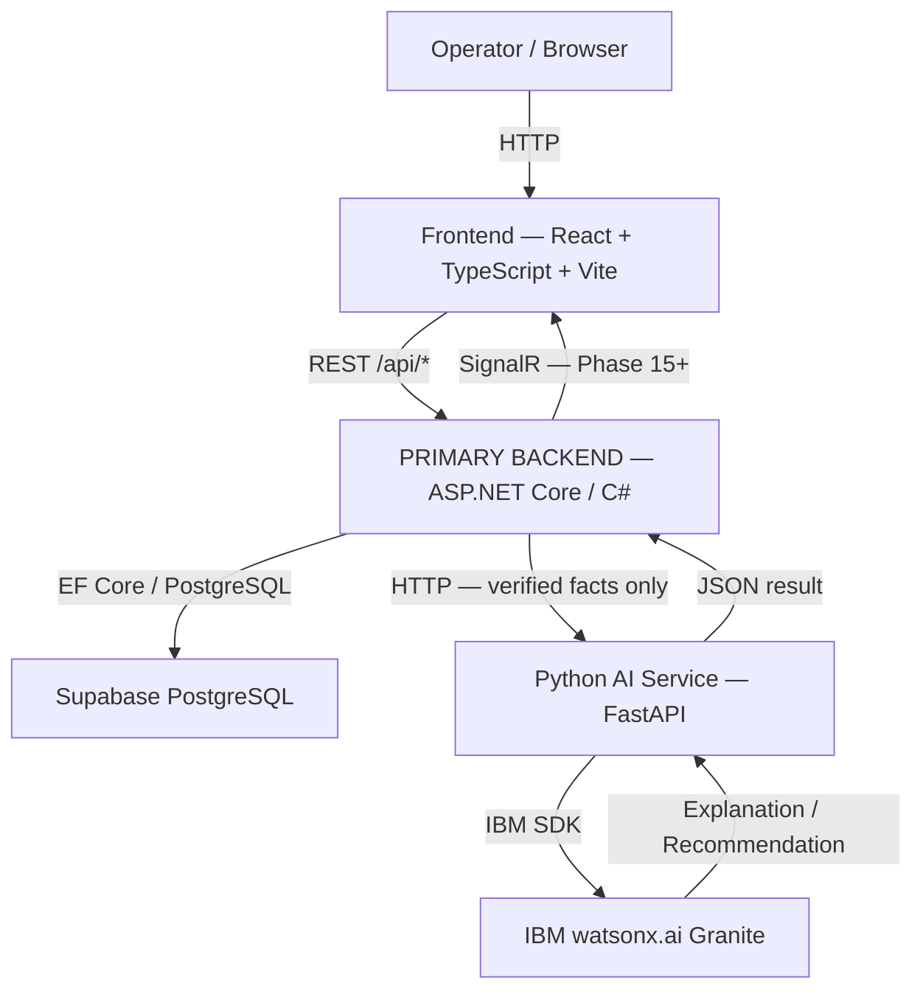

# SupplyShield AI — Architecture

## Overview

SupplyShield AI is a supply-chain operations intelligence platform. It monitors shipments, detects disruptions, monitors cold-chain sensor data, identifies idle fleet assets, and provides AI-powered recommendations — all from a centralized operations command center.

## System Architecture



## Layer Architecture (ASP.NET Core Backend)

```
SupplyShield.Api          ← Controllers, Program.cs, middleware
      ↓ references
SupplyShield.Application  ← Service interfaces, DTOs (no EF Core, no HTTP)
      ↓ references
SupplyShield.Domain       ← Entities, enums, domain rules (ZERO dependencies)
      ↑ also referenced by
SupplyShield.Infrastructure ← EF Core DbContext, repository impls,
                              Supabase wrapper, AI service HTTP client
```

**Dependency rule:**
- Domain has no dependencies.
- Application depends only on Domain.
- Infrastructure depends on Domain and Application.
- Api depends on Application and Infrastructure (for DI registration).
- Business logic never lives in controllers.

## AI Data Flow

```
Operator action in UI
        ↓
ASP.NET Core backend
        ↓ fetch verified facts from services/repositories
Assemble structured context (no raw user input)
        ↓
HTTP POST → Python AI Service
        ↓
IBM watsonx.ai / Granite model
        ↓
Parsed, validated explanation
        ↓
ASP.NET Core backend
        ↓
Frontend displays with evidence
```

**Critical AI rules:**
- AI receives ONLY verified structured facts from the backend.
- AI NEVER receives raw user input.
- AI MUST NOT invent IDs, costs, ETAs, temperatures, or disruption facts.
- AI failure returns a safe fallback — never a crash.

## AI Approval Flow

```
Deterministic recommendation (backend)
        ↓
Human operator reviews
        ↓
Explicit approval (UI confirmation dialog)
        ↓
ASP.NET Core backend applies action
        ↓
DecisionAudit record created
        ↓
Monitoring continues
```

Consequential actions can NEVER be applied without explicit operator approval.

## Components

| Component | Technology | Role |
|---|---|---|
| Frontend | React 18 + TypeScript + Vite | Operations command center UI |
| **Primary Backend** | **ASP.NET Core 10 / C#** | **Business logic, orchestration, REST API** |
| AI/ML Service | Python 3.11 + FastAPI | ML predictions, watsonx.ai explanations |
| Generative AI | IBM watsonx.ai (Granite) | Grounded explanations and operational Q&A |
| Database | Supabase PostgreSQL + EF Core | Operational data storage |
| Realtime | ASP.NET Core SignalR (Phase 15+) | Live updates to frontend |

## Domain Entities

| Entity | Description |
|---|---|
| `Shipment` | Tracked cargo movement |
| `Route` | Origin-to-destination path |
| `RouteSegment` | Single leg of a multi-segment route |
| `Disruption` | Active supply-chain event |
| `ShipmentDisruption` | Link between disruption and affected shipments |
| `Vehicle` | Fleet asset (truck, van, container) |
| `Carrier` | Transport company |
| `VehicleAssignment` | Vehicle-to-shipment assignment |
| `Sensor` | Cold-chain temperature sensor |
| `SensorReading` | Individual temperature reading |
| `ColdChainAlert` | Excursion alert (severity by deterministic rules) |
| `RecoveryRecommendation` | Ranked recommendation requiring approval |
| `DecisionAudit` | Immutable record of applied operator action |
| `ModelPrediction` | ML score stored for traceability |

## Directory Structure

```
src/
├── frontend/                    ← React + TypeScript + Vite
│   └── src/
│       ├── components/          ← Reusable UI components
│       ├── layouts/             ← AppShell, Sidebar, TopBar
│       ├── pages/               ← One page per route
│       ├── routes/              ← AppRoutes.tsx
│       ├── services/
│       │   ├── api.ts           ← All API calls (mock in Phase 2)
│       │   └── mock/            ← Phase 2 mock data (isolated)
│       ├── types/domain.ts      ← TypeScript domain types
│       └── styles/globals.css   ← Design tokens
│
├── backend/                     ← PRIMARY backend (ASP.NET Core / C#)
│   ├── SupplyShield.sln
│   ├── SupplyShield.Api/        ← Controllers, Program.cs
│   ├── SupplyShield.Application/← Service interfaces, DTOs
│   ├── SupplyShield.Domain/     ← Entities, enums (no deps)
│   ├── SupplyShield.Infrastructure/ ← EF Core, Supabase, AI client
│   └── tests/
│       └── SupplyShield.Api.Tests/ ← xUnit integration tests
│
└── ai-service/                  ← SEPARATE Python AI/ML service
    ├── app/
    │   ├── main.py              ← FastAPI app (port 8001)
    │   ├── core/                ← Config, logging
    │   ├── api/routes/          ← /health, /predict/*
    │   └── integrations/watsonx/← watsonx.ai client wrapper
    ├── tests/test_health.py
    └── requirements.txt
```

## Security Considerations

- All secrets in environment variables — never committed.
- `.env` and `appsettings.Local.json` are in `.gitignore`.
- Supabase service-role key is backend-only — never exposed to frontend or AI service.
- watsonx.ai credentials are AI-service-only.
- AI receives only backend-verified structured data.

## Phase Status

| Phase | Description | Status |
|---|---|---|
| 0–1 | Project preparation and repository | ✅ Complete |
| 2 | Application skeleton (corrected to ASP.NET Core) | ✅ Complete |
| 3 | Supabase / PostgreSQL database schema | ⏳ Next |
| 4 | Synthetic dataset | ⏳ Pending |
| 5 | Data ingestion / seeding | ⏳ Pending |
| 6 | ASP.NET Core backend / API implementation | ⏳ Pending |
| 7 | Command Center UI | ⏳ Pending |
| 8 | Disruption impact intelligence | ⏳ Pending |
| 9 | Recovery planner | ⏳ Pending |
| 10 | Fleet intelligence | ⏳ Pending |
| 11 | Cold-chain monitoring | ⏳ Pending |
| 12 | Python ML service | ⏳ Pending |
| 13 | IBM watsonx.ai | ⏳ Pending |
| 14 | What-If simulation | ⏳ Pending |
| 15 | Realtime + end-to-end integration | ⏳ Pending |
| 16–18 | Testing, demo, submission | ⏳ Pending |
